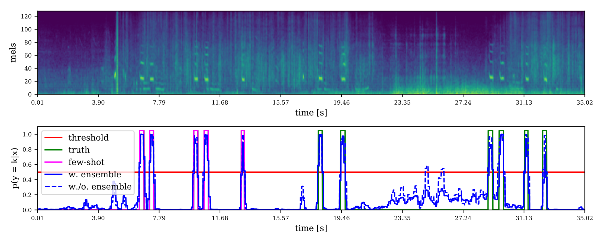

# 1. Few-shot bioacoustic event detection using an event-length adapted ensemble of prototypical networks

The official implementation of the method in the paper [Few-shot bioacoustic event detection using an event-length adapted ensemble of prototypical networks](https://dcase.community/documents/workshop2022/proceedings/DCASE2022Workshop_Martinsson_13.pdf).

Cite as

    @inproceedings{Martinsson2022,
        author = {Martinsson, John and Willbo, Martin and Pirinen, Aleksis and Mogren, Olof and Sandsten, Maria},
        booktitle = {The 7th Workshop on Detection and Classification of Acoustic Scenes and Events},
        file = {:home/john/Downloads/DCASE2022Workshop_Martinsson_13.pdf:pdf},
        number = {November},
        pages = {2--6},
        title = {{Few-shot bioacoustic event detection using an event-length adapted ensemble of prototypical networks}},
        year = {2022}
    }

The method came in third place among the team submissions in the [few-shot bioacoustic event detection task](https://dcase.community/challenge2022/task-few-shot-bioacoustic-event-detection-results) during the DCASE 2022 challenge.

Please consider citing our work if the source code is helpful in your research.

Start by cloning the github-repo and make the root of the github-repo your working directory.

    git clone https://github.com/johnmartinsson/dcase-bioacoustics-2022.git

# 2. Reproduce important results of the paper
The main figures of the paper can be reproduced by going through these sections:

- section 2.1, download the data
- section 2.2, download pre-made predictions and model weights
- section 2.3, evaluate and produce plots
- section 2.4, train models and make predictions (optional)

## 2.1 Download the data

We will
- download the challenge data into the ./data directory, 
- extract the data from the zip file, 
- rename (or copy) the directory, 
- and resample all the audio data to 22050Hz __in-place__.

A suggestion of commands to do so:

    cd data
    wget https://zenodo.org/record/6482837/files/Development_Set.zip
    unzip Development_Set.zip
    mv Development_Set Development_Set_22050Hz # cp -r Development_Set Development_Set_22050Hz  # (if you want to keep a copy)
    sh resample.sh
    
## 2.2 Download pre-made predictions and model weights

    wget https://www.dropbox.com/s/ad7jxb8z5b06tjd/final_ensemble.zip
    unzip final_ensemble.zip
    
The directory 'experiments/final_ensemble' will now contain the model weights for each model in the ensemble, and the predictions from each model for the validation data. To ensemble the predictions and evaluate continue to section 2.3. To make your own predictions skip to section 2.4.

## 2.3 Evaluate and produce plots
Setup the environment using Anaconda:

    conda create -n bioacoustics
    conda activate bioacoustics
    conda install --file requirements.txt
    conda install -c conda-forge librosa mir_eval

    jupyter notebook notebooks/results_notebook.ipynb
    
Start the "results_notebook.ipynb", and run the code to produce figure 2, figure 3 and figure 4.

The final challenge submissions for the test data can also be computed using this notebook.

## 2.4 Train models and make predictions
Assuming you have access to three GPU:s, a simple way to train the ensemble would be:

    CUDA_VISIBLE_DEVICES=0 python main.py pcen_speech train
    CUDA_VISIBLE_DEVICES=1 python main.py pcen_biodiversity train
    CUDA_VISIBLE_DEVICES=2 python main.py decibel train
    
the models should be in the 'experiments/final_ensemble' directory. There are five different runs for each time-frequency transform, each containing a trained model, the difference is explained in the paper, but shortly they have been trained on different train/val split of the base training dataset and with different random seeds. 

The next step is to make the validation data predictions (assumes that you have done section 2.1). Which can be done by:

    CUDA_VISIBLE_DEVICES=0 python main.py pcen_speech predict
    CUDA_VISIBLE_DEVICES=1 python main.py pcen_biodiversity predict
    CUDA_VISIBLE_DEVICES=2 python main.py decibel predict

this will loop over each of the five models for each time-frequency transform, and compute the embeddings for the support for each validation file and then infer the class probabilities for the unannotated parts of each validation file which are stored in the directory "predictions". These can then be evaluated separately or as an ensemble (see section 2.3).

To make the test data predictions:

    CUDA_VISIBLE_DEVICES=0 python main.py pcen_speech predict_test
    CUDA_VISIBLE_DEVICES=1 python main.py pcen_biodiversity predict_test
    CUDA_VISIBLE_DEVICES=2 python main.py decibel predict_test
